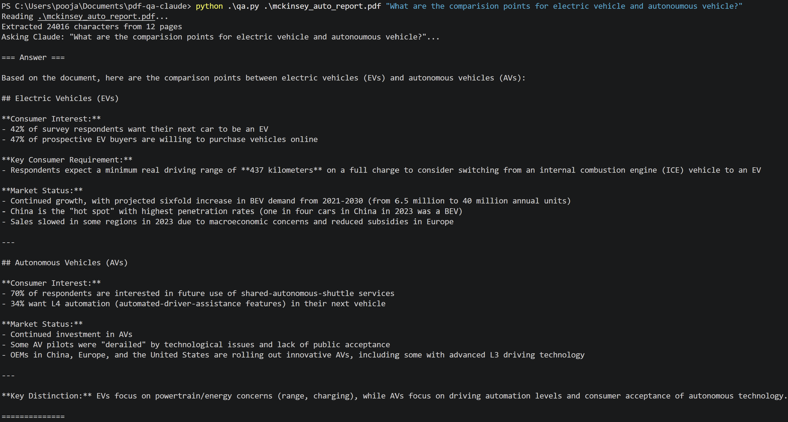

# PDF Q&A with Claude

Ask any question about a PDF document and get a grounded answer from Claude. The natural follow-up to my [PDF Summarizer](https://github.com/AdarshShrivastava1102/pdf-summarizer-claude) — same architecture, different use case.

## Demo


See [Examples](docs/example_qa.md) for 4 question types tested against an industry report.


## What it does

```bash
python qa.py mckinsey_ai.pdf "What are the top 3 AI use cases mentioned?"
```

Reads a PDF, extracts the text, sends Claude both the document and your question, and returns a focused answer based ONLY on the document content.

## Why I built it

After building the summarizer, I wanted to explore the next layer of RAG patterns: **question-answering with grounding**. The challenge isn't just getting an answer — it's making sure Claude answers from the document, not from its training data. The prompt design matters more than the code.

## Quick start

1. Clone this repo
2. Install dependencies:
```bash
   pip install anthropic pypdf python-dotenv
```
3. Create a `.env` file with your API key:
ANTHROPIC_API_KEY=sk-ant-api03-xxxxx
  
4. Run:
```bash
   python qa.py yourfile.pdf "your question here"
```

## How it differs from summarization

| Aspect | Summarizer | Q&A |
|---|---|---|
| Input | PDF | PDF + question |
| Prompt | "Summarize in 5 lines" | "Answer based ONLY on document" |
| Use case | TLDR a document | Find specific information |
| Hallucination risk | Low (broad task) | High (specific answers) — needs grounding |

## Design choices

- **Explicit grounding instruction** — "Answer based ONLY on the document. If the answer isn't there, say so honestly." This prevents Claude from filling gaps with training-data knowledge.
- **Role definition** — Tells Claude it's a "document Q&A assistant" — sharpens behavior.
- **`max_tokens=500`** — Larger than summarizer because answers can be longer than 5 lines.
- **8000-char input cap** — Same context-window safety as summarizer. Real RAG would chunk + retrieve.

## Tech stack

Python 3.11 · Anthropic SDK · pypdf · python-dotenv

## What I learned

- **Grounding instructions matter** — without "answer based ONLY on the document," Claude blends training knowledge with the document
- **Honesty instructions matter too** — adding "if the answer isn't there, say so" cut down on hallucinated answers significantly
- **Question phrasing affects answer quality** — specific questions get better answers than open-ended ones

## What's next

- Multi-turn Q&A (memory across questions)
- Document chunking + retrieval (real RAG, not stuffed prompt)
- Citation: show which page/paragraph the answer came from
- Evaluation harness: test answer quality systematically

## Author

**Adarsh Shrivastava** — AI Product Manager · IIM-A '24 · IIT-G '16

[LinkedIn](https://www.linkedin.com/in/adarsh-p110293) · [GitHub](https://github.com/AdarshShrivastava1102)
